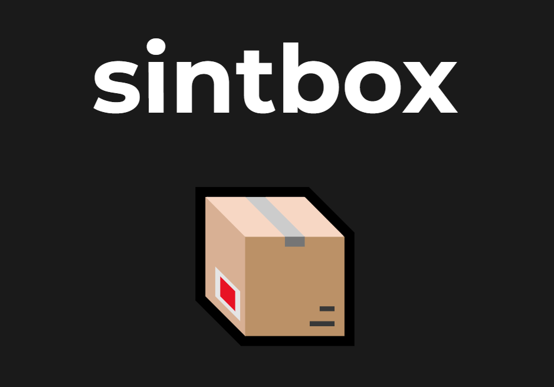

# sintbox

sintbox is free and open source web template for OSINT tools and cybersecurity. It comes with a template of Geolocation, a code editor, and Whois (API). 
When configured correctley sintbox casn be a powerful osint tool in your investigations.

```markdown
Welcome to sintbox

Explore the world of sintbox, your versatile toolbox for various utilities.
From geolocation and image analysis to text and code editing, sintbox has you covered.

Key Features:

Geolocate: Discover the geographical location of points of interest using advanced algorithms and geospatial data.
Editor: Edit text and code seamlessly with our versatile notepad featuring formatting options and code blocks.
Whois: Perform WHOIS checks on domains to retrieve detailed information about registrations, ownership, and expiration.
Unleash the power of sintbox and simplify your online tasks.

📦 Enjoy exploring sintbox!
```

